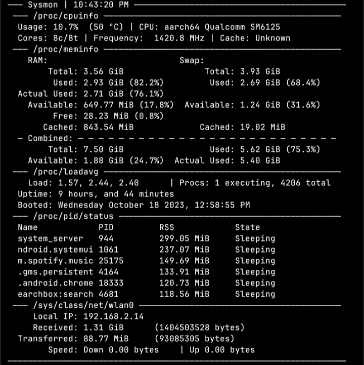

# sysmon, a system monitor "ready to use"

using [**curses**](https://docs.python.org/3/howto/curses.html)

# preview




# what is sysmon
sysmon is a system monitor which is **ready to use** and easy to understand. it uses [**linux's /proc pseudo filesystem**](https://www.kernel.org/doc/html/latest/filesystems/proc.html) to read information and [**curses**](https://docs.python.org/3/howto/curses.html) to display them. the only thing you have to do is git clone this repo, and run the sysmon file

# what can sysmon do?
 - show cpu information, like model, temperature (1), frequency (2), cores (1) and threads count, and cache memory size (1)
 - show memory information, like total, available, used (3) and cached ram and swap information
 - show system load, entities and uptime
 - show the proccesses (6 by default) that are consuming the most VmRSS, including the state and name
 - show network information, like device, transferred and received, and speed

1. information reported **might** not be correct

2. ive heard this depends on the kernel, i am not sure. sysmon might not show the max frequency the manufacturer website reports

3. there are 2 used columns, because the calculations are different. "actual used" == htop-like report, "used" = MemTotal - MemAvailable

# using sysmon
on the terminal, run
```sh
git clone https://github.com/devlocalhost/sysmon && cd sysmon && ./sysmon
```
you only need to run this command once. to run it again, you could make an "alias" (make sure you're in `sysmon` directory)
```sh
echo $(pwd)/sysmon | sudo tee /usr/local/bin/sysmon && sudo chmod +x /usr/local/bin/sysmon
```
this will `echo` the current working dir + `/sysmon`, create a new file in `/usr/local/bin` as `sysmon`, with executable permissions. if `/usr/local/bin` is in your PATH, then typing `sysmon` anywhere will execute sysmon

# help and usage
```
  -h, --help                           show this help message and exit
  -nc, --nocpuinfo                     disables cpuinfo (cpu information, like usage, model, and more)
  -nm, --nomeminfo                     disables meminfo (memory information, like total, used and more)
  -nl, --noloadavg                     disables loadavg (load times information, including uptime, and more)
  -np, --noprocpid                     disables procpid (shows the most vmrss consuming processes)
  -nn, --nonetstats                    disables network_stats (network stats, like received/transfered bytes, and
                                       more)
  -nt, --notemp                        disables cpu temperature
  -ns, --noswap                        disables swap information in meminfo
  -m, --metric                         use metric (1000) instead of IEC (1024) unit for data convertion
  -p INT, --procs INT                  how many processes to show in procpid. Default: 6
  -s FLOAT, --sleep FLOAT              refresh time. Default: 1.0
  -i INTERFACE, --interface INTERFACE  select which interface to use for netstats
```

# usage in other scripts
## why
so whoever wants can use it on other scripts

## how
first, you need to copy the `plugins` directory into the root directory of your script. you do not need all those plugins, but you DO need the `extra.py` file. then, all you have to do is import the plugin you want in your script. for example:
```python
from plugins import meminfo # import the meminfo plugin (meminfo.py)

print(meminfo.main()) # execute the main function
```

another example, but modifying the output (by disabling swap stats):
```python
from plugins import meminfo, extra # same thing as above
# but importing the extra.py file, so we can modify a bit this plugin

extra.SHOW_SWAP = False # disable swap stats

print(meminfo.main())
```

you can `cat extra.py` and see what "flags" the plugins have, and modify whatever you want (check for "START" and "READ")

now, this is a bit ugly. you might not want to get everything, or maybe you want to modify how the output looks. dont worry, i will implement an feature/flag, which will return the output as a JSON dictionary

# bug/suggestion/correction
please open a issue, including traceback and a screenshot if you found a bug

if you want to suggest a new feature, or if you found something that is not correct (for example, incorrect cpu temperature or ram usage/something else) feel free to open an issue

# credits
many thanks to [skyblueborb](https://github.com/skyblueborb) for helping me test, fix and make the cpu temperature feature better

also many thanks to [ari](https://ari-web.xyz/gh) for helping me with the padding/formatting of the text
